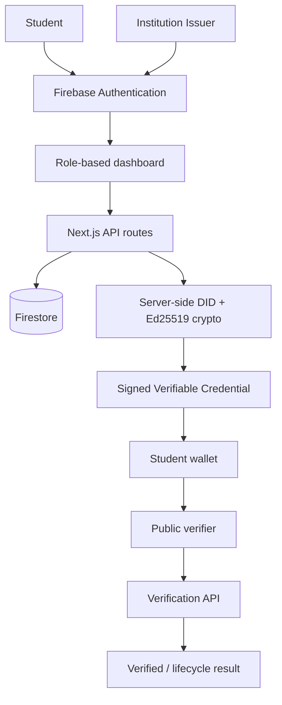
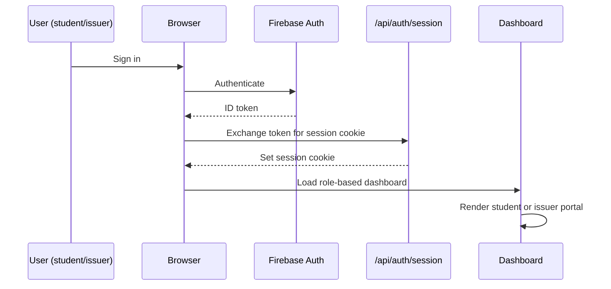
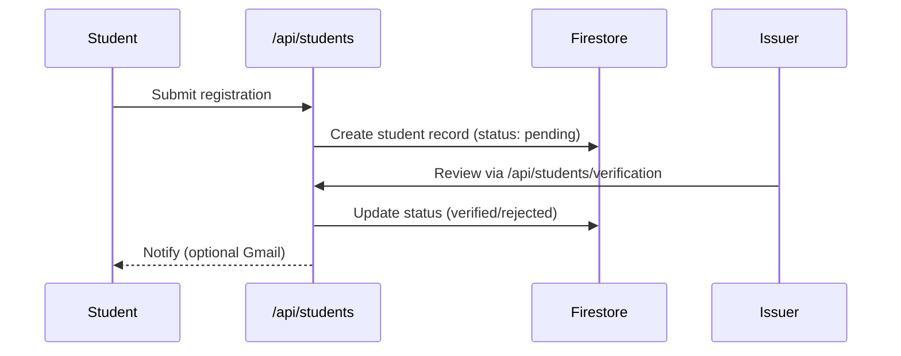
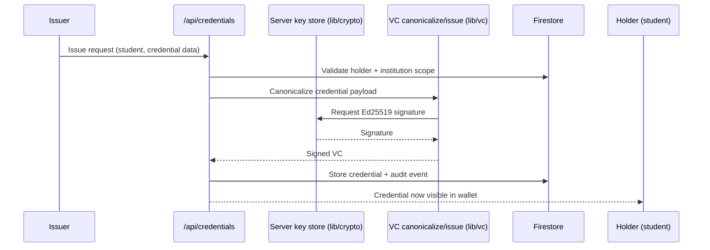
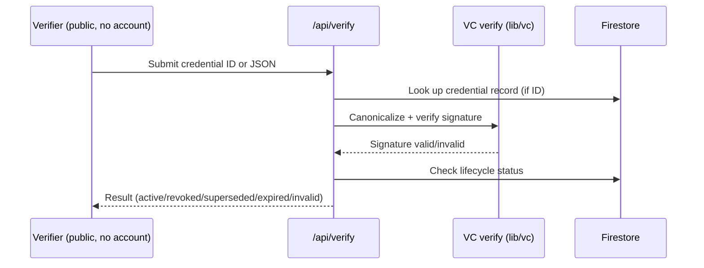
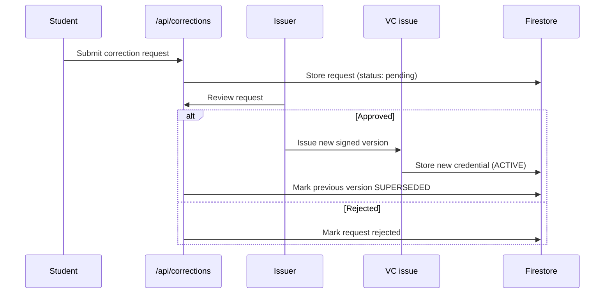
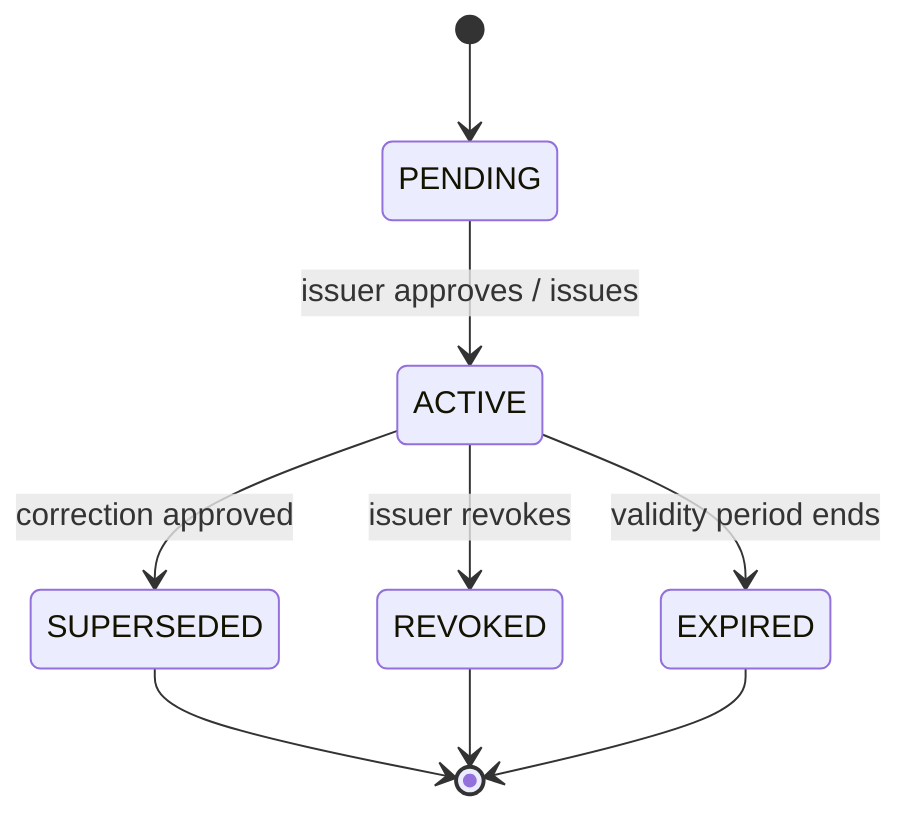
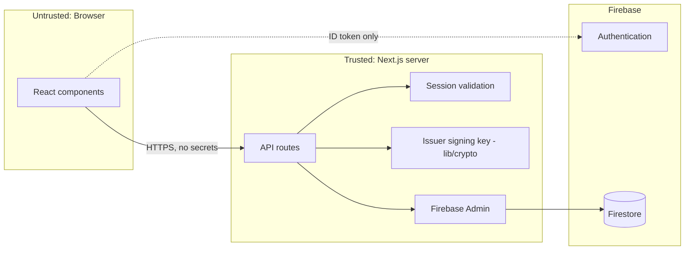
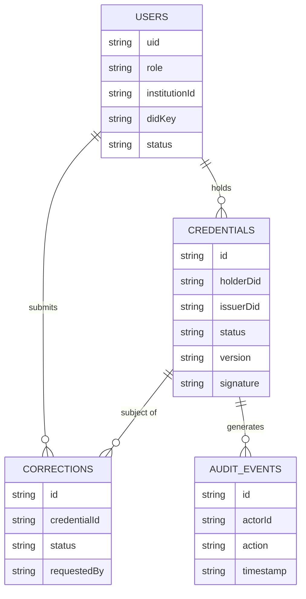
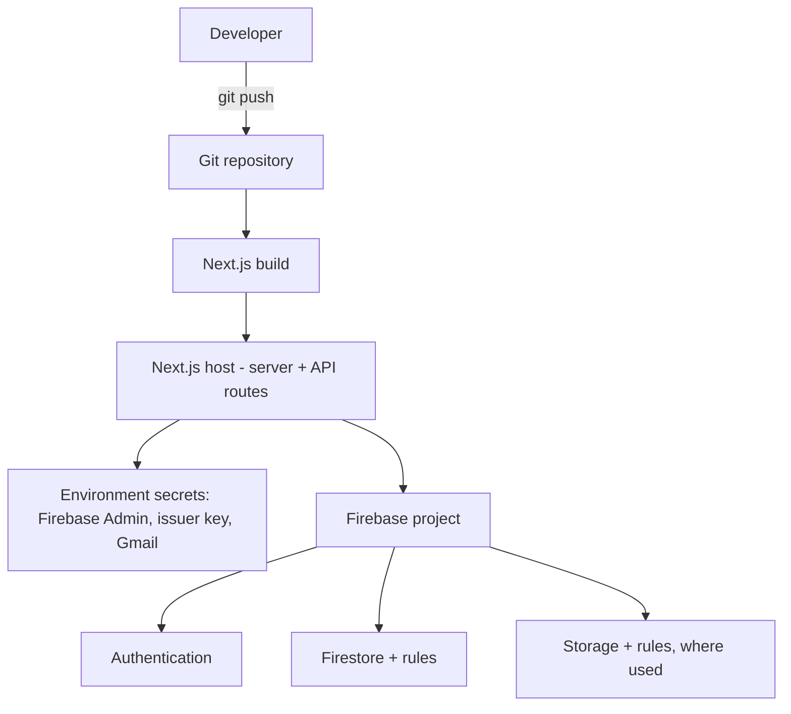

# VIGYAN.ID — Architecture

This document describes the system as implemented: a Next.js App Router application with Firebase Authentication, Firestore persistence, and server-only Ed25519/DID cryptography. It reflects the structure and behavior described in the project's own source layout (`src/app`, `src/components`, `src/lib`, `src/types`); if the live repository has since diverged, the code is authoritative.

## 1. High-level architecture

## 2. Authentication flow

Demo mode bypasses Firebase Auth with isolated demo identities when Firebase is intentionally left unconfigured — it is explicit and not a fallback triggered by misconfiguration.

## 3. Student registration flow

## 4. Credential issuance flow

## 5. Credential verification flow

## 6. Correction / reissuance flow

Corrections never overwrite history — an approved correction creates a new signed record and marks the prior one superseded.

## 7. Credential lifecycle state machine

## 8. Security / trust boundary diagram

Private issuer key material and Firebase Admin credentials exist only inside the server boundary. The browser never receives signing keys, Admin credentials, or unfiltered Firestore access — every read/write goes through an API route that enforces session and role checks.

## 9. Data architecture

Exact field names and collection structure live in `src/lib/store` and `src/lib/vc/types.ts` — treat those types (and any deployed Firestore security rules) as the source of truth, not this diagram.

## 10. Deployment architecture

Production deployment should include: managed secret storage (never `.env` files in the repo), restrictive Firestore/Storage rules, HTTPS everywhere, monitoring and alerting, backups, periodic issuer key rotation, rate limiting/abuse controls on public endpoints, and an independent security review before handling real institutional data.

## Component responsibilities

| Layer | Responsibility |
|---|---|
| `src/app` | Routes, layouts, loading states, API route handlers |
| `src/components` | Shared UI (`auth-provider`, `dashboard-shell`, `login-screen`, `ui-atoms`) and role portals (`issuer/issuer-portal`, `student/*`) |
| `src/lib/auth` | Session handling (`session.ts`), demo identity path (`demo.ts`) |
| `src/lib/firebase` | Client SDK config (`client.ts`) vs. Admin SDK config (`admin.ts`) — kept strictly separate |
| `src/lib/crypto` | Ed25519 key handling (`ed25519.ts`, `issuerKey.ts`) |
| `src/lib/vc` | Canonicalization, issuance, verification (`canonicalize.ts`, `issue.ts`, `verify.ts`) |
| `src/lib/store` | Firestore data access (`firestore.ts`) with an in-memory variant (`memory.ts`) for local/demo use |
| `src/lib/gmail` | Optional server-side email notifications (`send.ts`) |
| `src/types` | Shared domain types (`domain.ts`) |

## Known limitations

- No zero-knowledge proofs, BBS+ signatures, SD-JWT, or selective disclosure — roadmap items, not implemented.
- No decentralized/on-chain revocation registry; lifecycle status is authoritative in Firestore.
- `did:key` only — no external DID method resolution or interoperability layer yet.
- No independent security audit performed to date.

See [README.md](README.md) for setup instructions and feature overview.